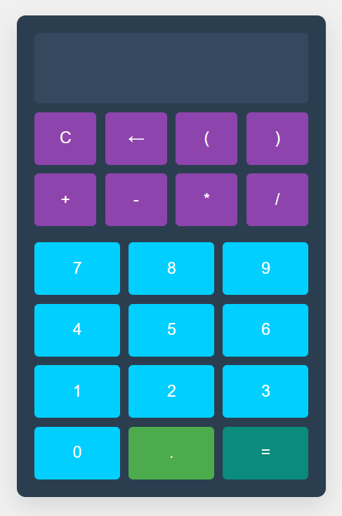

# CALCBAS - Calculadora



## Introducción

Calculadora basica en Python-Flask

## Instalación

Instrucciones para instalar

```bash
# Clonar el repositorio
git clone https://github.com/alexismendozaa/calculadora.git

# Ejecutar la aplicación
python app.py

